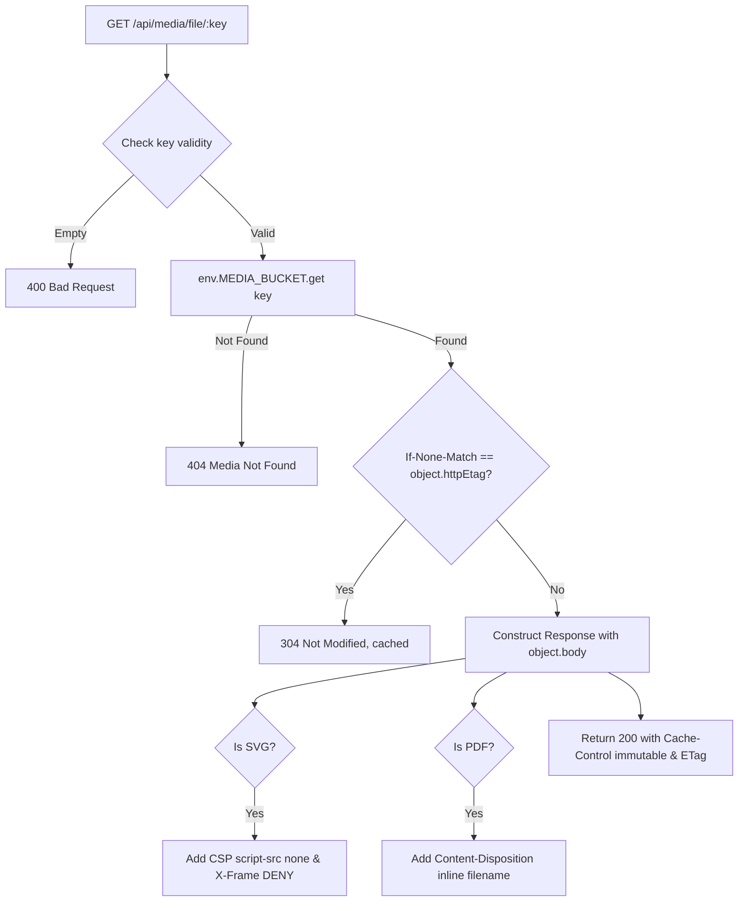

# System Specification: Cloudflare R2 Media Storage & Streaming Architecture

| Field                  | Value                                                                                                                                                                                                                                                                                                                                                          |
| :--------------------- | :------------------------------------------------------------------------------------------------------------------------------------------------------------------------------------------------------------------------------------------------------------------------------------------------------------------------------------------------------------- |
| **Specification ID**   | `sys-media-r2`                                                                                                                                                                                                                                                                                                                                                 |
| **Status**             | `Implemented`                                                                                                                                                                                                                                                                                                                                                  |
| **Scope**              | Cross-Cutting System Storage & Edge Streaming                                                                                                                                                                                                                                                                                                                  |
| **Primary Code Paths** | [`src/routes/api/media/file/$.ts`](file:///d:/winterest-project/winterest-portfolio-v2/src/routes/api/media/file/$.ts), [`src/routes/api/media/index.ts`](file:///d:/winterest-project/winterest-portfolio-v2/src/routes/api/media/index.ts), [`src/routes/api/media/$id.ts`](file:///d:/winterest-project/winterest-portfolio-v2/src/routes/api/media/$id.ts) |
| **Bindings & Tables**  | `env.MEDIA_BUCKET` (R2), `media` table (D1 in [`src/db/schema.ts`](file:///d:/winterest-project/winterest-portfolio-v2/src/db/schema.ts))                                                                                                                                                                                                                      |
| **Last Updated**       | 2026-09-06                                                                                                                                                                                                                                                                                                                                                     |

---

## 1. Overview & Capabilities

The Media Storage & Streaming subsystem provides persistent, high-performance object storage for media assets (images, project screenshots, and PDF documents) using **Cloudflare R2** coupled with metadata tracking in **Cloudflare D1**.

### Key Capabilities

- **Direct Edge Object Storage**: Binary payloads are stored in Cloudflare R2 bucket (`MEDIA_BUCKET`), eliminating database bloat and disk persistence issues.
- **Edge Streaming Handler**: Serves assets directly through `/api/media/file/*` without third-party CDN domain requirements.
- **Aggressive Browser & Edge Caching**: Emits `ETag` headers and supports `304 Not Modified` conditional requests, paired with `Cache-Control: public, max-age=31536000, immutable`.
- **SVG & PDF Security Sanitization**: Injects strict Content Security Policy (`default-src 'none'; script-src 'none'`) and `X-Frame-Options: DENY` for SVG files, and forces `inline; filename="..."` disposition for PDF documents.
- **Atomic Deletion**: Synchronously deletes objects from R2 storage and removes the matching record from D1.

---

## 2. Database & Storage Contract

### Cloudflare R2 Binding (`wrangler.jsonc`)

- **Binding Name**: `MEDIA_BUCKET`
- **Bucket Identifier**: `winterest-portfolio-media`

### Object Key Structure

Keys are structured deterministically into categorized prefixes:

```txt
{folder}/{timestamp}-{uuid8}-{cleanBaseName}.{extension}
```

- `folder`: `'documents'` for PDF files, `'projects'` for images.
- Example: `projects/1741300000000-a1b2c3d4-portfolio-dashboard-preview.webp`

### D1 Database Schema (`media` table)

```ts
export const media = sqliteTable(
  'media',
  {
    id: text('id').primaryKey(),
    filename: text('filename').notNull(),
    url: text('url').notNull(),
    mimeType: text('mime_type').notNull(),
    size: integer('size').notNull().default(0),
    width: integer('width'),
    height: integer('height'),
    alt: text('alt'),
    createdAt: integer('created_at', { mode: 'timestamp' })
      .notNull()
      .default(sql`(unixepoch())`),
    updatedAt: integer('updated_at', { mode: 'timestamp' })
      .notNull()
      .default(sql`(unixepoch())`),
  },
  (table) => [
    index('media_filename_idx').on(table.filename),
    index('media_mime_type_idx').on(table.mimeType),
  ],
)
```

---

## 3. Server & Streaming Contracts

### Endpoints

| Endpoint            | Method   | Auth                  | Description                                       |
| :------------------ | :------- | :-------------------- | :------------------------------------------------ |
| `/api/media/file/*` | `GET`    | Public                | Edge streaming handler with conditional caching   |
| `/api/media`        | `GET`    | Dashboard (`editor`+) | List media assets with search & limit filters     |
| `/api/media`        | `POST`   | Dashboard (`editor`+) | Upload `multipart/form-data` to R2 & record in D1 |
| `/api/media/:id`    | `DELETE` | Dashboard (`editor`+) | Delete R2 object and delete D1 row                |

### Validation & Limits ([`src/features/media/validation.ts`](file:///d:/winterest-project/winterest-portfolio-v2/src/features/media/validation.ts))

- **Maximum File Size**: `10MB` (`MAX_FILE_SIZE_BYTES = 10 * 1024 * 1024`).
- **Allowed MIME Types**:
  - Images: `image/jpeg`, `image/png`, `image/webp`, `image/gif`, `image/svg+xml`, `image/avif`
  - Documents: `application/pdf`

---

## 4. Edge Streaming & Security Pipeline



---

## 5. Security & Invariants

1. **Path Traversal Protection**: Key sanitization ensures keys are URL-decoded and validated.
2. **SVG XSS Mitigation**: Any file served with `image/svg+xml` or ending in `.svg` receives `Content-Security-Policy: default-src 'none'; script-src 'none'; frame-ancestors 'none'` to neutralize embedded `<script>` payloads.
3. **MIME Sniffing Prevention**: All streaming responses include `X-Content-Type-Options: nosniff`.
4. **Authorized Ingestion**: Only authenticated dashboard users (`owner`, `admin`, `editor`) can upload or delete media assets.

---

## 6. Acceptance Criteria & DoD Checklist

- [ ] Uploading valid image stores binary in R2 and returns 201 with public URL.
- [ ] Uploading file exceeding 10MB fails with 400 Bad Request.
- [ ] Uploading disallowed MIME type fails with 400 Bad Request.
- [ ] Streaming endpoint returns 304 when `If-None-Match` matches asset ETag.
- [ ] SVG assets include strict CSP preventing script execution.
- [ ] Deleting media deletes both R2 object and D1 metadata record.
- [ ] Media validation passes Vitest suite ([`src/features/media/__tests__/validation.test.ts`](file:///d:/winterest-project/winterest-portfolio-v2/src/features/media/__tests__/validation.test.ts)).
