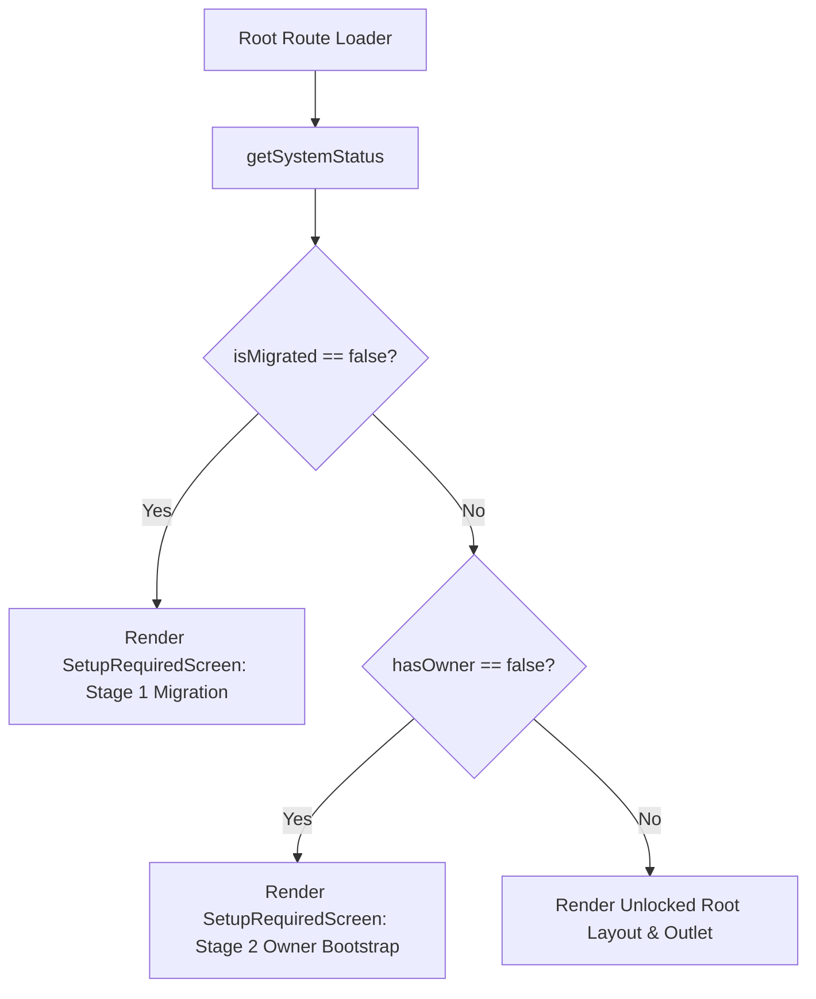

# System Specification: Two-Stage Setup Guard Architecture

| Field                  | Value                                                                                                                                                                                                                                                                                                                                                                                      |
| :--------------------- | :----------------------------------------------------------------------------------------------------------------------------------------------------------------------------------------------------------------------------------------------------------------------------------------------------------------------------------------------------------------------------------------- |
| **Specification ID**   | `sys-setup-guard`                                                                                                                                                                                                                                                                                                                                                                          |
| **Status**             | `Implemented`                                                                                                                                                                                                                                                                                                                                                                              |
| **Scope**              | Cross-Cutting System Root Guard & Provisioning                                                                                                                                                                                                                                                                                                                                             |
| **Primary Code Paths** | [`src/features/system/server-functions.ts`](file:///d:/winterest-project/winterest-portfolio-v2/src/features/system/server-functions.ts), [`src/components/system/setup-required.tsx`](file:///d:/winterest-project/winterest-portfolio-v2/src/components/system/setup-required.tsx), [`src/routes/__root.tsx`](file:///d:/winterest-project/winterest-portfolio-v2/src/routes/__root.tsx) |
| **Database Tables**    | `user` (checks `role = 'owner'`)                                                                                                                                                                                                                                                                                                                                                           |
| **Last Updated**       | 2026-09-06                                                                                                                                                                                                                                                                                                                                                                                 |

---

## 1. Overview & Capabilities

The Two-Stage Setup Guard acts as a gatekeeper at the root layout of **Winterest**. It ensures that the application never attempts to render public or dashboard routes against an unmigrated database or an un-provisioned owner state.

### Key Capabilities

- **Stage 1 (Database Migration Guard)**: Automatically detects if tables do not exist in D1 (catching SQLite `no such table: user` errors). Blocks UI and presents migration instructions.
- **Stage 2 (Owner Provisioning Guard)**: If tables exist but zero users have `role = 'owner'`, locks down the application and presents interactive CLI owner creation instructions.
- **Stage 3 (Unlocked Production State)**: Once an owner exists, the gate opens fully, rendering standard public routes, navigation, and dashboard access.
- **Bilingual Guidance**: Clear instructions in English and Indonesian explaining exact terminal commands for both local and remote environments.
- **Resource Protection**: Suppresses unnecessary downstream data queries (e.g. `useSiteSettings`, project queries) during locked setup states.

---

## 2. Server Contract & Status Detection

### Server Function: `getSystemStatus` ([`src/features/system/server-functions.ts`](file:///d:/winterest-project/winterest-portfolio-v2/src/features/system/server-functions.ts))

Executed during root route evaluation:

```ts
export type SystemStatus = {
  hasOwner: boolean
  isMigrated: boolean
  error?: string
}
```

### Detection Logic

1. Queries `count()` from `user` table where `role = 'owner'`.
2. If SQLite throws error matching `no such table`:
   - Returns `{ hasOwner: false, isMigrated: false, error: 'Database tables are not migrated yet.' }`.
3. If query succeeds with `ownerCount === 0`:
   - Returns `{ hasOwner: false, isMigrated: true }`.
4. If query succeeds with `ownerCount > 0`:
   - Returns `{ hasOwner: true, isMigrated: true }`.

---

## 3. UI Guard Architecture ([`src/routes/__root.tsx`](file:///d:/winterest-project/winterest-portfolio-v2/src/routes/__root.tsx))



### SetupRequiredScreen Component ([`src/components/system/setup-required.tsx`](file:///d:/winterest-project/winterest-portfolio-v2/src/components/system/setup-required.tsx))

- Features interactive tab switcher between **Local** and **Remote** commands.
- Includes quick-copy button with clipboard feedback (`navigator.clipboard.writeText`).
- Features a manual reload button to re-evaluate system state after running terminal commands.

---

## 4. Operational Commands & Instructions

### Stage 1: Migration Required

- **Local Command**: `bun run db:migrate:local`
- **Remote Command**: `bun run db:migrate:remote`

### Stage 2: Owner Account Required

- **Local Command**: `bun run create-owner:local`
- **Remote Command**: `bun run create-owner:remote`

---

## 5. Security & Invariants

1. **Information Masking**: The setup screen does not reveal connection strings, database IDs, or internal filesystem paths to the browser.
2. **Fail-Closed Principle**: If database connection fails for any reason, the system fails closed into the locked setup screen rather than throwing unhandled runtime exceptions.
3. **Owner Precedence**: Public self-registration is never opened, even when no owner exists; provisioning is restricted strictly to local or Cloudflare-authenticated CLI execution.

---

## 6. Acceptance Criteria & DoD Checklist

- [ ] When D1 database has no tables, root layout renders Migration Required screen.
- [ ] When D1 database has tables but 0 owners, root layout renders Owner Account Required screen.
- [ ] Running `bun run create-owner:local` provisions an owner and unlocks the root layout upon refresh.
- [ ] Tab switching between Local and Remote updates command snippets correctly.
- [ ] Copy button copies command snippet to clipboard.
- [ ] TypeScript check passes: `bun run check`.
